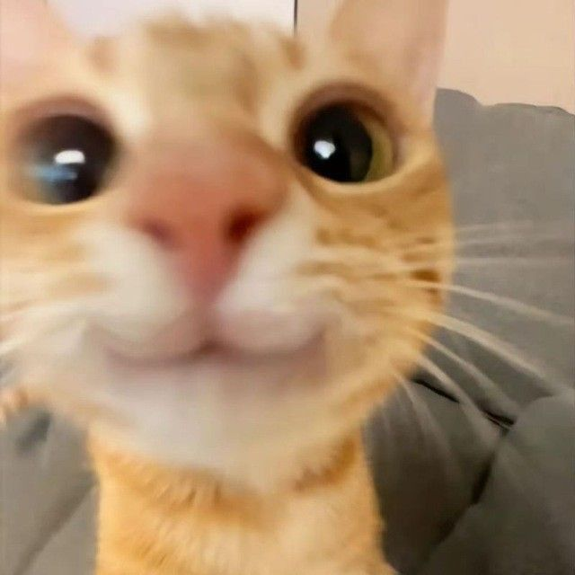
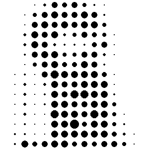

# 🎞️ Halftone Animation Generator

A Python script that transforms an image into a **halftone dot animation**, mimicking the gradual evolution of halftone resolution (like classic print or comic art effects). Inspired by analog printing patterns and experimental halftone designs.

---

## 🖼️ Before / After Comparison

<h3 align="center">Before ➡️ After</h3>

<p align="center">
  
  
</p>

---

## 🧩 Features

- Converts any image into a **grayscale halftone**
- Generates a sequence of frames with decreasing dot size
- Outputs an animated **GIF** visualizing the halftone transformation
- Lightweight and fully customizable

---

## 🛠️ Requirements

```bash
pip install pillow numpy
